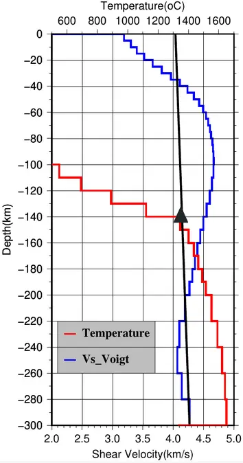
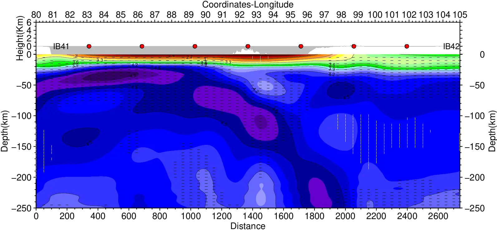

<head>
    <link rel="stylesheet" href="../academicons-1.9.4/css/academicons.css"/>
    <link rel="stylesheet" href="../assets/css/tempCSS.css"/>  
    
     
</head>

# My Research

Let's get to the real stuff now! Sooner or Later, I will also add more description to these projects and, if possible, also include a scaled-down version of the codes used.

## 1. Investigating Craton Dynamics and Ore Deposit Formation for Sustainable Critical Minerals Supply
- Duration:- August 2024 to Present
- with Prof. Jeroen van Hunen and other EarthSafe collaborators

Details coming up!
 

## 2. Conversion of shear wave velocity to temperature
<!-- - Duration:- October 2023 to Present -->
<!-- - With Prof. Supriyo Mitra, IISER Kolkata & Dr. Ajay Kumar, IISER Pune -->

As a side project of my Master's Thesis, I also converted my shear wave velocity model(obtained in the previous project) to temperature. I used 2 methods for the conversion. The first method is the one developed by Priestly et al., 2006, which uses an empirical relation between shear wave velocity and temperature. The second method is based on the Litmod approach, developed by Kumar et al., 2020, which calculates material properties at a range of PT conditions and compares them to observations to find appropriate temperatures. It is observed that both the methods give similar results. 

Finally, we obtain a lithosphere thickness model accross India and Tibet, from the temperature model.

Right image: *Conversion of shear wave velocity to temperature, for a single node*

 
    
 
 

## 3. Joint anisotropic inversion of Love and Rayleigh wave dispersion
<!-- - Duration:- September 2022 to Present -->
- With Prof. Supriyo Mitra, IISER Kolkata

In this project, we have jointly inverted Love and Rayleigh wave surface wave dispersion curves across Tibet, Himalayas, and Central India to obtain an anisotropic shear wave velocity structure. The implications of this research will be:-
- A detailed shear wave velocity structure, giving a detailed structure of the Indian lithosphere beneath Tibet
- A picture of deformation due to past tectonic processes obtained from radial anisotropy. Interpretation of radial anisotropy would give us a glimpse of the geodynamics of the region.
- Reduced discrepancy between Love and Rayleigh wave, which arises in an anisotropic medium

***   

#### Publications or conference articles from this research
1. <b>Chakraborty, A.</b>, Ghosh, M., Dey, S., Sharma, S., Bhattacharya, S. N., and Mitra, S.: Deformation of the Indian Lithosphere from radial anisotropy: Signatures of laterally varying plate geometry beneath Tibet and hotspot volcanism beneath the Deccan Plateau. , EGU General Assembly 2024, Vienna, Austria, 14–19 Apr 2024, EGU24-17055,<a href="https://doi.org/10.5194/egusphere-egu24-17055" target="_blank">https://doi.org/10.5194/egusphere-egu24-17055</a>
 
2. Ghosh, M., <b>Chakraborty, A.</b>, Dey, S., Kharjana, I., Sharma, S., Bhattacharya, S. N., and Mitra, S, Radially anisotropic shear-wave velocity structure of northern India, Himalaya and Tibet, EGU General Assembly 2023, Vienna, Austria, 24–28 Apr 2023, EGU23-11721, <a href="https://doi.org/10.5194/egusphere-egu23-11721" target="_blank">https://doi.org/10.5194/egusphere-egu23-11721</a>
 

*A cross-section of the downgoing Indian plate under the Indo-Burma subduction zone. The mantle wedge shows a negative anisotropy(Indicated by white lines)*

 

## 4. GPE evolution from 150Mya to preset day
- Duration:- May 2022 to July 2022
- With Dr. Attreyee Ghosh, IISc Bengaluru

Here, the initial objective was to see the variation of temperature in the oceanic lithosphere with age and construct a lithospheric thickness map for oceanic plates. This was first done for present-day oceanic age grids and later calculated from 200 Myr to the present day to see its evolution.  

In the next part of the project, I applied present crustal thickness and topography data from CRUST1.0 and ETOPO1 datasets to calculate present-day GPE(Gravitational Potential Energy). I looked into its evolution from 250 Mya to the present day using a paleo-topographic dataset  [Scotese, 2021] while making other reasonable assumptions.

- A possible further extension could possibly have been to calculate the contribution to the lithospheric stress field due to GPE differences(Which I did not get enough time to complete in the short summer vacation !).

<!-- <video autoplay loop width="700px" height="400px" controls="controls"> -->
<!-- <source src="./assets/videos/reversed.mp4" type="video/mp4"/> -->

<iframe width="700px" height="400px" src="https://www.youtube-nocookie.com/embed/lxgIwUdDW7w?&autoplay=1&mute=1&playlist=lxgIwUdDW7w&loop=1" title="YouTube video player" frameborder="0" allow="accelerometer; autoplay; clipboard-write; encrypted-media; gyroscope;" allowfullscreen></iframe>

*A video showing evolution of GPE from 150 million to present day*
