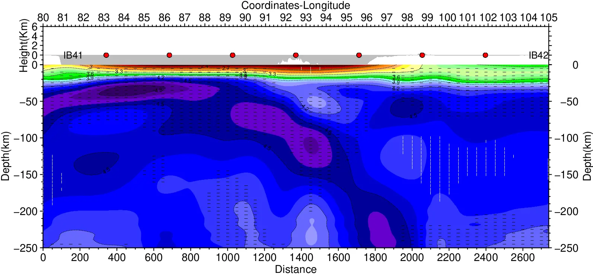

<head>
    <link rel="stylesheet" href="../academicons-1.9.4/css/academicons.css"/>
    <link rel="stylesheet" href="../assets/css/tempCSS.css"/>  
     
        

        

        ❅
        

        

        ❆
        

        

        ❅
        

        

        ❆
        

        

        ❅
        

        

        ❆
        

        

        ❅
        

        

        ❆
        

        

        ❅
        

        

        ❆
        

        

        ❅
        

        

        ❆
        

        

        ❆
        

        

        ❆
        

        

        ❆
        

        

        ❆
        

        

        ❆
        

        

        ❆
        

        

        ❆
        

        

        ❆
        

        

        ❆
        

        

        ❆
        

        

        ❆
        

        

        ❆
        

        
  
</head>

# My Research

Let's get to the real stuff now! Sooner or Later, I will also add more description to these projects and, if possible, also include a scaled-down version of the codes used.
## 1. Conversion of Shear wave velocity to Temperature
- October 2023 to Present

Here, I am trying to convert My shear wave velocity model(obtained in the previous project) to Temperature.
- The main Objective is to obtain the Lithospheric thickness from the converted temperature. Here Lithosphere-Asthenosphere Boundary is considered a division between 2 very different heat transport regimes, the conducting lithosphere and the isentropic asthenosphere. 

## 2. Joint Anisotropic Inversion of Love and Rayleigh wave dispersion

- September 2022 to October 2023
<!-- - With Prof. Supriyo Mitra -->

In this Project, we have jointly inverted Love and Rayleigh wave surface wave dispersion curves across Tibet, Himalayas, and Central India to obtain an Anisotropic Shear wave velocity structure. The implications of this research will be:-
- A detailed Shear wave velocity structure, giving a detailed structure of the Indian Lithosphere beneath Tibet
- A picture of deformation due to past tectonic processes obtained from Radial Anisotropy. Interpretation of Radial Anisotropy would give us a glimpse of the geodynamics of the region.
- Reduced discrepancy between Love and Rayleigh wave, which arises in an anisotropic medium

***   

#### Publications or Conference Articles from this research
1. Ghosh, M., Chakraborty, A., Dey, S., Kharjana, I., Sharma, S., Bhattacharya, S. N., and Mitra, S, Radially anisotropic shear-wave velocity structure of northern India, Himalaya and Tibet, EGU General Assembly 2023, Vienna, Austria, 24–28 Apr 2023, EGU23-11721, <a href="https://doi.org/10.5194/egusphere-egu23-11721" target="_blank">https://doi.org/10.5194/egusphere-egu23-11721</a>
 

*A cross-section of the downgoing Indian plate under the Indo-Burma Subduction Zone. The mantle wedge shows a negative anisotropy(Indicated by white lines)*

## 3. GPE Evolution from 150Mya to Preset Day

- May 2022 to July 2022
<!-- - With Dr. Attreyee Ghosh, IISc Bengaluru -->

Here, the initial objective was to see the variation of temperature in the oceanic lithosphere with age and construct a lithospheric thickness map for oceanic plates. This was first done for present-day oceanic age grids and later calculated from 200 Myr to the present day to see its evolution.  

In the next part of the project, I applied present crustal thickness and topography data from CRUST1.0 and ETOPO1 datasets to calculate present-day GPE(Gravitational Potential Energy). I looked into its evolution from 250 Mya to the Present day using a paleo-topographic dataset  [Scotese, 2021] while making other reasonable assumptions.

- A possible further extension could possibly have been to calculate the contribution to the lithospheric stress field due to GPE differences(Which I did not get enough time to complete in the short summer vacation !).

<!-- <video autoplay loop width="700px" height="400px" controls="controls"> -->
<!-- <source src="./assets/videos/reversed.mp4" type="video/mp4"/> -->

<iframe width="700px" height="400px" src="https://www.youtube-nocookie.com/embed/lxgIwUdDW7w?&autoplay=1&mute=1&playlist=lxgIwUdDW7w&loop=1" title="YouTube video player" frameborder="0" allow="accelerometer; autoplay; clipboard-write; encrypted-media; gyroscope;" allowfullscreen></iframe>

*A video showing evolution of GPE from 150 million to present day*
